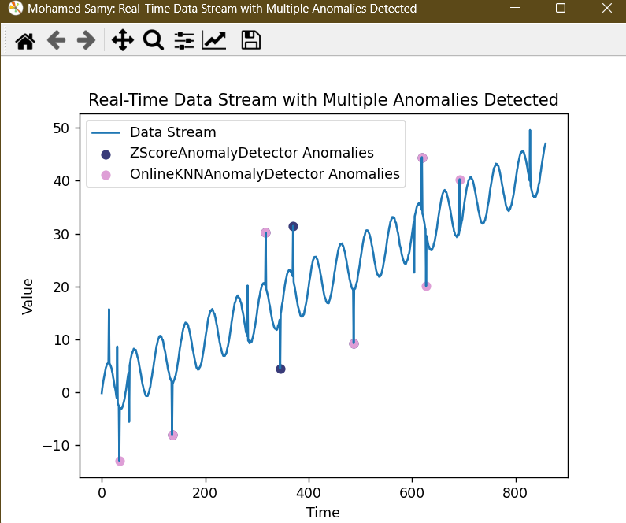

# Realtime-Anomaly-Detection-Algorithms

 A simple data stream simulation with various anomaly detection algorithms



## Introduction

This project is a simple data stream simulation with various anomaly detection algorithms. The data stream is generated by a sine wave with a random noise.

## Data Stream

- Sine wave with a random noise

## Anomaly Detection Algorithms

## Algorithms

- [X] Z-Score
- [X] Moving Average

## Requirements

- Python 3.10

## Installation

```bash
pip install -r requirements.txt
```

## Usage

```bash
python main.py
```
